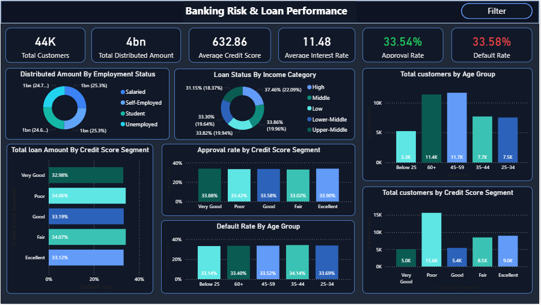
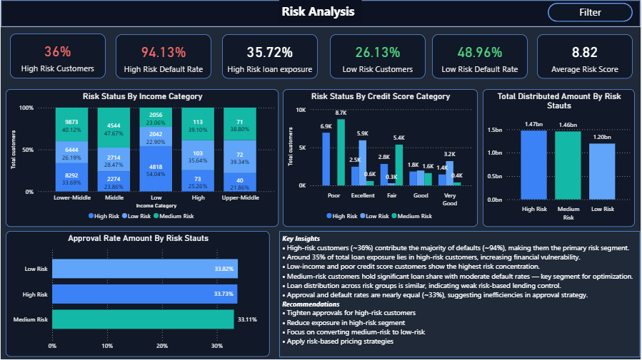

# 📊 Banking Risk & Loan Performance Dashboard

## 🚀 Project Overview

This project analyzes banking customer data to evaluate loan performance, customer risk, and default behavior using SQL and Power BI.

It includes a complete risk analysis model to help identify high-risk customers and optimize lending strategies.

---

## 🛠️ Tools Used

* SQL (Data Cleaning & Transformation)
* Power BI (Data Visualization & Dashboard)
* Excel (Initial Data Handling)

---

## 🔄 Data Flow
Raw Data → SQL Cleaning → Power BI → Dashboard → Insights

---

## 🧩 Data Modeling

The project follows a relational data model:

* `customers` → customer details
* `credit_profile` → credit score & default history
* `loan_details` → loan amount & loan status

Tables are connected using `customer_id` to enable cross-table analysis.

---

## 💼 Business Impact
This dashboard helps banks:
- Reduce loan defaults  
- Improve approval strategies  
- Identify high-risk customer segments  
- Optimize loan exposure

---
## ▶️ How to Use
1. Download the .pbix file  
2. Open in Power BI Desktop  
3. Use slicers to explore customer segments
---

## 📊 Dashboard Pages

### 1️⃣ Overview Dashboard

Provides a high-level summary of:

* Total customers & loan distribution
* Approval & default rates
* Customer segmentation (age, income, credit score)

📸

---

### 2️⃣ Risk Analysis Dashboard

Focuses on risk modeling and business insights:

* Risk segmentation (High / Medium / Low)
* Default rate by risk category
* Loan exposure at risk
* Income & credit score as risk drivers
* Approval rate analysis

📸

---

## 🔍 Key Insights

* High-risk customers (~36%) contribute the majority of defaults (~94%)
* ~35% of loan exposure lies in high-risk customers
* Low-income and poor credit score customers are the most risky
* Approval and default rates are nearly equal (~33%), indicating inefficiencies

---

## 💡 Business Recommendations

* Tighten approvals for high-risk customers
* Reduce exposure in high-risk segments
* Focus on converting medium-risk customers to low-risk
* Implement risk-based pricing strategies

---

## 📈 Key Features

* Built a rule-based risk scoring model using DAX
* Performed cross-table analysis using relational modeling
* Designed interactive dashboards with slicers and KPIs
* Derived business insights for decision-making

---

## 👨‍💻 Author

**Abhay A S**
📧 [abhayas014@gmail.com](mailto:abhayas014@gmail.com)
🔗 https://www.linkedin.com/in/abhay-a-s
💻 https://github.com/Abhayas4
